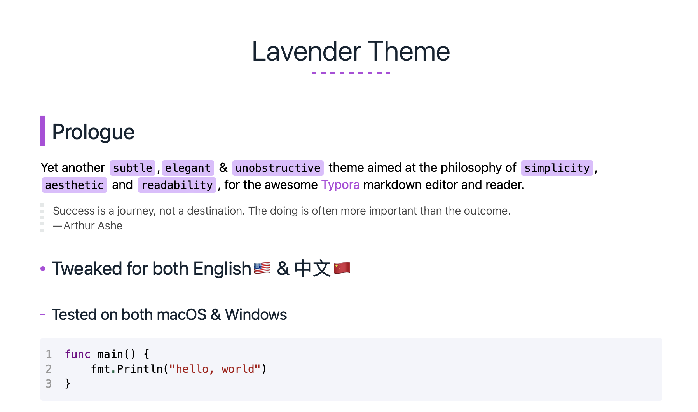

# typora-Lavender-theme

Base on [etigerstudio/typora-misty-theme](https://github.com/etigerstudio/typora-misty-theme)

Put lavender.css to your theme folder, restart typora, then select Miracle theme.

open theme folder: Typora/Settings/Appearance/Open Theme Folder
select Miracle: Themes/Lavender

